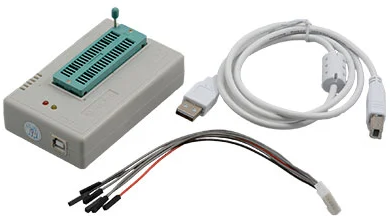
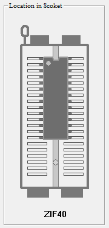
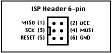
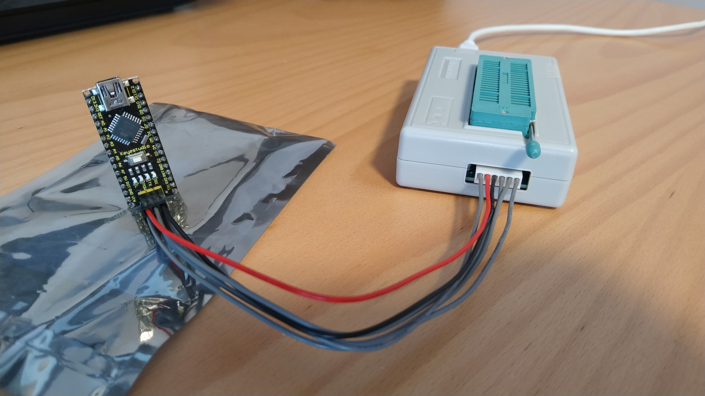

# minipro

minipro is an open source program for controlling the MiniPRO TL866xx series of chip programmers. The source code is available at https://gitlab.com/DavidGriffith/minipro/

This repository is my notes on how to use it with a [TL866II Plus](http://www.xgecu.com/en/TL866_main.html) universal programmer on openSUSE.




## Building

The instructions in the readme on gitlab do not work on openSUSE.

In addition to the regular build tools like `make` and `gcc`, I installed these packages:

* `srecord`
* `rpmdevtools`
* `rpm-build` 
* `libusb-1_0-devel`

To build:

1. `$ git clone https://gitlab.com/DavidGriffith/minipro/`
2. Overwrite `minipro.spec` in the cloned repository with this one: [minipro.spec](rpm/minipro.spec)
3. The spec file specifies a certain commit to build. Update the commit hash and date if you want to build a different version.
4. If you haven't built rpms before, setup the directory structure with: `$ rpmdev-setuptree`
5. `$ rpmdev-spectool -g -R minipro.spec`
6. `$ rpmbuild -ba minipro.spec`

After it completes you can find the rpm here, ready for installation with zypper: `~/rpmbuild/RPMS/x86_64/minipro-0.1-20200402.bf67708.x86_64.rpm`

Remember to add yourself to the `plugdev` group.


## How to use

Beware of using the programmer connected to an unpowered USB-hub. It draws a lot of power in use, and can potentially damage chips.

Start by finding the correct name of the device for use with the software. You can search using the `-L` parameter like this: 

`$ minipro -L atmega328`

The concrete device could be a `ATMEGA328P@DIP28` in this case. Include this with the `-p` parameter for all future operations.

Insert the chip with pin 1 (see the dot) pointing towards the lever of the ZIF socket:



(_Image taken from the Windows software_)


### Working with EEPROMs

Read the contents of the EEPROM and save it to the file eeprom.bin:

`$ minipro -p "AT28C16@DIP24" -r eeprom.bin`

Write the contents of the file eeprom.bin to the EEPROM:

`$ minipro -p "AT28C16@DIP24" -w eeprom.bin`

Verify that the EEPROM has the same contents as the file eeprom.bin:

`$ minipro -p "AT28C16@DIP24" -m eeprom.bin`


### Working with AVR

AVR microcontrollers may have both flash memory for the program and EEPROM for the data, in addition to configuration parameters in the form of "fuses". All these can be read and written to, unless certain lock bits have been set. Lock bits can stop you from reading the chip, but erasing the chip will also reset the lock bits.

Writing to the chip will by default erase the chip. This can be confusing when you want to write to the different parts of the chip, as writing one of them will blank the other part. This can be avoided by erasing the chip first with the `-E` parameter, and then specifying the `-e` parameter when writing to disable automatic erase.

Erase chip:

`$ minipro -p "ATMEGA328P@DIP28" -E`

Write the contents of the file eeprom.bin to the EEPROM:

 `$ minipro -p "ATMEGA328P@DIP28" -c data -w eeprom.bin -e`

Write the contents of the file program.bin to the flash memory: 

`$ minipro -p "ATMEGA328P@DIP28" -c code -w program.bin -e`

Write the configuration for fuses and lock bits specified in the file fuses.cfg to the chip:

`$ minipro -p "ATMEGA328P@DIP28" -c config -w fuses.cfg -e`

This is the format for fuses.cfg:

```
fuses_lo = 0x62
fuses_hi = 0xd9
fuses_ext = 0xff
lock_byte = 0xff
```

Read the datasheet or use this http://www.engbedded.com/fusecalc/ to understand what this means.

Like the examples from working with EEPROM, you can verify the contents with the `-m` parameter, and read the contents into a file with the `-r` parameter:

```
$ minipro -p "ATMEGA328P@DIP28" -r firmware.bin
Found TL866II+ 04.2.111 (0x26f)
Chip ID OK: 0x1E950F
Reading Code...  0.66Sec  OK
Reading Data...  0.04Sec  OK
Reading fuses... 0.00Sec  OK

$ ls -la
-rw-r--r--  1 blurpy users  32768 jan.  22 20:12 firmware.bin
-rw-r--r--  1 blurpy users   1024 jan.  22 20:12 firmware.eeprom.bin
-rw-r--r--  1 blurpy users     66 jan.  22 20:12 firmware.fuses.conf
```

Beware that the chip might appear completely empty if the fuses are configured for read protection. It will look like this:

```
$ hexdump firmware.bin 
0000000 ffff ffff ffff ffff ffff ffff ffff ffff
*
0008000
```


### Working with AVR using In Circuit Serial Programming (ICSP)

The TL866II Plus has an ICSP port on the side of the unit that allows you to flash a chip without removing it from the circuit board. A cable for connecting to the port should also be in the box.

This is the pinout:


(_Image taken from the Windows software_)

Many Arduino devices come with a 6-pin ICSP header like this:



Here is an example of connecting the TL866II Plus to an Arduino Nano clone (ks0173) using ICSP:



There are a couple of things to note:

1. The pinout on different boards might not have the same orientation or order. Check with a multimeter to make sure you connect the wires correctly.
2. The TL866II Plus outputs 5 volts on VCC. Some boards might only tolerate 3.3 volts and could fry. Power the board through other means to avoid that, or maybe try lowering the voltage using resistors (not tested).

The commands are very similar to when you have a chip in the ZIF socket. You only need to add `-i`, like this:

```
$ minipro -p "ATMEGA328P@TQFP32" -r ks0173.bin -i
Found TL866II+ 04.2.111 (0x26f)
Activating ICSP...
Chip ID OK: 0x1E950F
Reading Code...  7.19Sec  OK
Reading Data...  0.23Sec  OK
Reading fuses... 0.00Sec  OK
```

Result:

```
$ ls -la
-rw-r--r-- 1 blurpy users  32768 jan.  23 13:56 ks0173.bin
-rw-r--r-- 1 blurpy users   1024 jan.  23 13:56 ks0173.eeprom.bin
-rw-r--r-- 1 blurpy users     66 jan.  23 13:56 ks0173.fuses.conf
```

You can use `-I` instead of `-i` to use ICSP with VCC disabled.


### Hardware verifications

You can test for good pin connections with a particular chip inserted in the programmer:

`$ minipro -p AT28C256 -z`

To test that all the pins in the programmer works as intended, you can run a full hardware self check. Be sure to remove any chips from the programmer, otherwise you risk damaging it.

`$ minipro -t`


### Update firmware

You wont find the firmware as a standalone download, so you need to download the Windows software `Xgpro` from the homepage. Unrar the downloaded file to find a Windows executable. Unrar the executable to find the firmware file `updateII.dat`.
 
 ```
$ unrar x XgproV1008_setup.rar
$ unrar x XgproV1008_Setup.exe
```
 
It's also possible to extract the files using the website https://extract.me/

Update the firmware like this:

`$ minipro -F updateII.dat`


#### Troubleshooting

I tried to update the firmware using a virtual machine with Windows and the official Xgpro software once. The programmer was functioning fine in the VM, but updating the firmware failed with no reason given. The programmer did not function anymore after that. Any command issued with minipro gave me the message "_Found TL866II+ in bootloader mode_" and quit. After reading this [issue](https://gitlab.com/DavidGriffith/minipro/issues/148) it looked like the firmware update process in minipro is much more reliable than the official software, so I tested, and the update completed successfully, and the programmer was once again working. 
